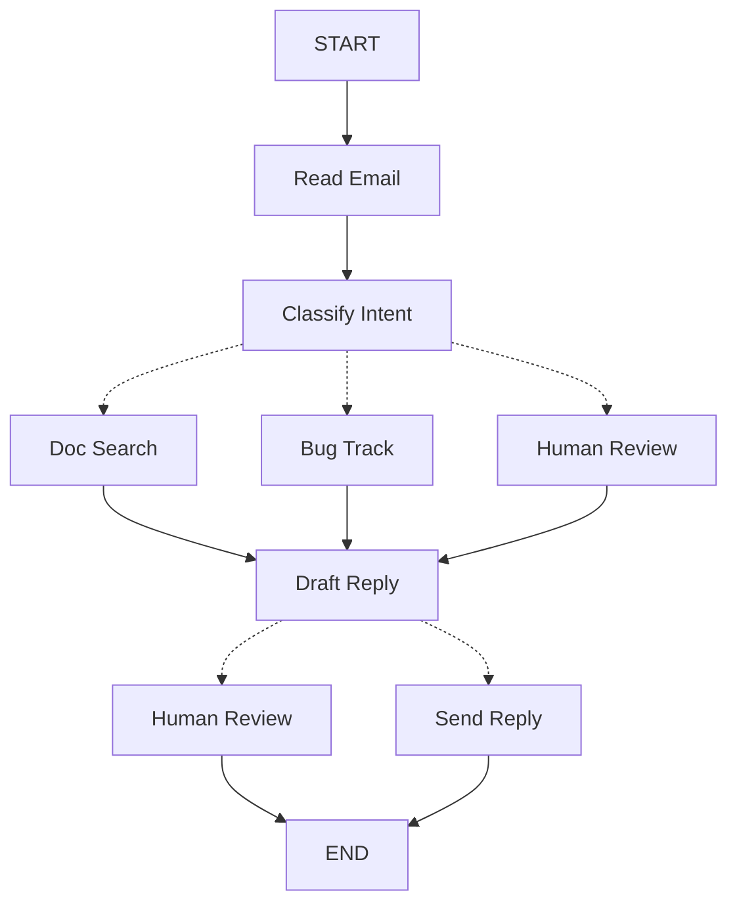

LangGraph can change how you think about the agents you build. When you build an agent with LangGraph, you will first break it apart into discrete steps called **nodes**. Then, you will describe the different decisions and transitions for each of your nodes. Finally, you will connect your nodes together through a shared **state** that each node can read from and write to. In this tutorial, we'll guide you through the thought process of building a customer support email agent with LangGraph.

## Start with the process you want to automate

Imagine that you need to build an AI agent that handles customer support emails. Your product team has given you these requirements:

The agent should:

- Read incoming customer emails
- Classify them by urgency and topic
- Search relevant documentation to answer questions
- Draft appropriate responses
- Escalate complex issues to human agents
- Schedule follow-ups when needed

Example scenarios to handle:

1. Simple product question: "How do I reset my password?"
2. Bug report: "The export feature crashes when I select PDF format"
3. Urgent billing issue: "I was charged twice for my subscription!"
4. Feature request: "Can you add dark mode to the mobile app?"
5. Complex technical issue: "Our API integration fails intermittently with 504 errors"

To implement an agent in LangGraph, you will usually follow the same five steps.

## Step 1: Map out your workflow as discrete steps

Start by identifying the distinct steps in your process. Each step will become a **node** (a function that does one specific thing). Then sketch how these steps connect to each other.



The arrows show possible paths, but the actual decision of which path to take happens inside each node.

Now that you've identified the components in your workflow, let's understand what each node needs to do:

- Read Email: Extract and parse the email content
- Classify Intent: Use an LLM to categorize urgency and topic, then route to appropriate action
- Doc Search: Query your knowledge base for relevant information
- Bug Track: Create or update issue in tracking system
- Draft Reply: Generate an appropriate response
- Human Review: Escalate to human agent for approval or handling
- Send Reply: Dispatch the email response

<Tip>
Notice that some nodes make decisions about where to go next (Classify Intent, Draft Reply, Human Review), while others always proceed to the same next step (Read Email always goes to Classify Intent, Doc Search always goes to Draft Reply).
</Tip>

## Step 2: Identify what each step needs to do

For each node in your graph, determine what type of operation it represents and what context it needs to work properly.

<CardGroup cols={2}>
    <Card title="LLM Steps" icon="brain" href="#llm-steps">
        Use when you need to understand, analyze, generate text, or make reasoning decisions
    </Card>
    <Card title="Data Steps" icon="database" href="#data-steps">
        Use when you need to retrieve information from external sources
    </Card>
    <Card title="Action Steps" icon="bolt" href="#action-steps">
        Use when you need to perform external actions
    </Card>
    <Card title="User Input Steps" icon="user" href="#user-input-steps">
        Use when you need human intervention
    </Card>
</CardGroup>

### LLM Steps

When a step needs to understand, analyze, generate text, or make reasoning decisions:

<AccordionGroup>
    <Accordion title="Classify Intent Node">
        - Static context (prompt): Classification categories, urgency definitions, response format
        - Dynamic context (from state): Email content, sender information
        - Desired outcome: Structured classification that determines routing
    </Accordion>

    <Accordion title="Draft Reply Node">
        - Static context (prompt): Tone guidelines, company policies, response templates
        - Dynamic context (from state): Classification results, search results, customer history
        - Desired outcome: Professional email response ready for review
    </Accordion>
</AccordionGroup>

### Data Steps

When a step needs to retrieve information from external sources:

<AccordionGroup>
    <Accordion title="Document Search Node">
        - Parameters: Query built from intent and topic
        - Retry strategy: Yes, with exponential backoff for transient failures
        - Caching: Could cache common queries to reduce API calls
    </Accordion>

    <Accordion title="Customer History Lookup">
        - Parameters: Customer email or ID from state
        - Retry strategy: Yes, but with fallback to basic info if unavailable
        - Caching: Yes, with time-to-live to balance freshness and performance
    </Accordion>
</AccordionGroup>

### Action Steps

When a step needs to perform an external action:

<AccordionGroup>
    <Accordion title="Send Reply Node">
        - When to execute: After approval (human or automated)
        - Retry strategy: Yes, with exponential backoff for network issues
        - Should not cache: Each send is a unique action
    </Accordion>

    <Accordion title="Bug Track Node">
        - When to execute: Always when intent is "bug"
        - Retry strategy: Yes, critical to not lose bug reports
        - Returns: Ticket ID to include in response
    </Accordion>
</AccordionGroup>

### User Input Steps

When a step needs human intervention:

<AccordionGroup>
    <Accordion title="Human Review Node">
        - Context for decision: Original email, draft response, urgency, classification
        - Expected input format: Approval boolean plus optional edited response
        - When triggered: High urgency, complex issues, or quality concerns
    </Accordion>
</AccordionGroup>

## Step 3: Design your state

State is the shared [memory](/oss/javascript/concepts/memory) accessible to all nodes in your agent. Think of it as the notebook your agent uses to keep track of everything it learns and decides as it works through the process.

### What belongs in state?

Ask yourself these questions about each piece of data:

<CardGroup cols={2}>
    <Card title="Include in State" icon="check">
        Does it need to persist across steps? If yes, it goes in state.
    </Card>

    <Card title="Don't Store" icon="code">
        Can you derive it from other data? If yes, compute it when needed instead of storing it in state.
    </Card>
</CardGroup>

For our email agent, we need to track:

- The original email and sender info (can't reconstruct these)
- Classification results (needed by multiple downstream nodes)
- Search results and customer data (expensive to re-fetch)
- The draft response (needs to persist through review)
- Execution metadata (for debugging and recovery)

### Keep state raw, format prompts on-demand

<Tip>
A key principle: your state should store raw data, not formatted text. Format prompts inside nodes when you need them.
</Tip>

This separation means:

- Different nodes can format the same data differently for their needs
- You can change prompt templates without modifying your state schema
- Debugging is clearer - you see exactly what data each node received
- Your agent can evolve without breaking existing state

Let's define our state:


```typescript
import * as z from "zod";

// Define the structure for email classification
const EmailClassificationSchema = z.object({
  intent: z.enum(["question", "bug", "billing", "feature", "complex"]),
  urgency: z.enum(["low", "medium", "high", "critical"]),
  topic: z.string(),
  summary: z.string(),
});

const EmailAgentState = z.object({
  // Raw email data
  emailContent: z.string(),
  senderEmail: z.string(),
  emailId: z.string(),

  // Classification result
  classification: EmailClassificationSchema.optional(),

  // Raw search/API results
  searchResults: z.array(z.string()).optional(),  // List of raw document chunks
  customerHistory: z.record(z.any()).optional(),  // Raw customer data from CRM

  // Generated content
  responseText: z.string().optional(),
});

type EmailAgentStateType = z.infer<typeof EmailAgentState>;
type EmailClassificationType = z.infer<typeof EmailClassificationSchema>;
```


Notice that the state contains only raw data - no prompt templates, no formatted strings, no instructions. The classification output is stored as a single dictionary, straight from the LLM.

## Step 4: Build your nodes


Now we implement each step as a function. A node in LangGraph is just a JavaScript function that takes the current state and returns updates to it.


### Handle errors appropriately

Different errors need different handling strategies:

| Error Type | Who Fixes It | Strategy | When to Use |
|------------|--------------|----------|-------------|
| Transient errors (network issues, rate limits) | System (automatic) | Retry policy | Temporary failures that usually resolve on retry |
| LLM-recoverable errors (tool failures, parsing issues) | LLM | Store error in state and loop back | LLM can see the error and adjust its approach |
| User-fixable errors (missing information, unclear instructions) | Human | Pause with `interrupt()` | Need user input to proceed |
| Unexpected errors | Developer | Let them bubble up | Unknown issues that need debugging |

<Tabs>
    <Tab title="Transient errors" icon="rotate">
        Add a retry policy to automatically retry network issues and rate limits:


    ```typescript
    import type { RetryPolicy } from "@langchain/langgraph";

    workflow.addNode(
    "searchDocumentation",
    searchDocumentation,
    {
        retryPolicy: { maxAttempts: 3, initialInterval: 1.0 },
    },
    );
    ```


    </Tab>

    <Tab title="LLM-recoverable" icon="brain">
        Store the error in state and loop back so the LLM can see what went wrong and try again:


    ```typescript
    import { Command } from "@langchain/langgraph";

    async function executeTool(state: State) {
    try {
        const result = await runTool(state.toolCall);
        return new Command({
        update: { toolResult: result },
        goto: "agent",
        });
    } catch (error) {
        // Let the LLM see what went wrong and try again
        return new Command({
        update: { toolResult: `Tool error: ${error}` },
        goto: "agent"
        });
    }
    }
    ```


    </Tab>

    <Tab title="User-fixable" icon="user">
        Pause and collect information from the user when needed (like account IDs, order numbers, or clarifications):


    ```typescript
    import { Command, interrupt } from "@langchain/langgraph";

    async function lookupCustomerHistory(state: State) {
    if (!state.customerId) {
        const userInput = interrupt({
        message: "Customer ID needed",
        request: "Please provide the customer's account ID to look up their subscription history",
        });
        return new Command({
        update: { customerId: userInput.customerId },
        goto: "lookupCustomerHistory",
        });
    }
    // Now proceed with the lookup
    const customerData = await fetchCustomerHistory(state.customerId);
    return new Command({
        update: { customerHistory: customerData },
        goto: "draftResponse",
    });
    }
    ```


    </Tab>

    <Tab title="Unexpected" icon="triangle-exclamation">
        Let them bubble up for debugging. Don't catch what you can't handle:


    ```typescript
    async function sendReply(state: EmailAgentStateType): Promise<void> {
    try {
        await emailService.send(state.responseText);
    } catch (error) {
        throw error;  // Surface unexpected errors
    }
    }
    ```


    </Tab>
</Tabs>


### Implementing our email agent nodes

We'll implement each node as a simple function. Remember: nodes take state, do work, and return updates.

<AccordionGroup>
    <Accordion title="Read and classify nodes" icon="brain">


    ```typescript
    import { StateGraph, START, END, Command } from "@langchain/langgraph";
    import { HumanMessage } from "@langchain/core/messages";
    import { ChatAnthropic } from "@langchain/anthropic";

    const llm = new ChatAnthropic({ model: "claude-sonnet-4-5-20250929" });

    async function readEmail(state: EmailAgentStateType) {
    // Extract and parse email content
    // In production, this would connect to your email service
    console.log(`Processing email: ${state.emailContent}`);
    return {};
    }

    async function classifyIntent(state: EmailAgentStateType) {
    // Use LLM to classify email intent and urgency, then route accordingly

    // Create structured LLM that returns EmailClassification object
    const structuredLlm = llm.withStructuredOutput(EmailClassificationSchema);

    // Format the prompt on-demand, not stored in state
    const classificationPrompt = `
    Analyze this customer email and classify it:

    Email: ${state.emailContent}
    From: ${state.senderEmail}

    Provide classification including intent, urgency, topic, and summary.
    `;

    // Get structured response directly as object
    const classification = await structuredLlm.invoke(classificationPrompt);

    // Determine next node based on classification
    let nextNode: "searchDocumentation" | "humanReview" | "draftResponse" | "bugTracking";

    if (classification.intent === "billing" || classification.urgency === "critical") {
        nextNode = "humanReview";
    } else if (classification.intent === "question" || classification.intent === "feature") {
        nextNode = "searchDocumentation";
    } else if (classification.intent === "bug") {
        nextNode = "bugTracking";
    } else {
        nextNode = "draftResponse";
    }

    // Store classification as a single object in state
    return new Command({
        update: { classification },
        goto: nextNode,
    });
    }
    ```


    </Accordion>

    <Accordion title="Search and tracking nodes" icon="database">


    ```typescript
    async function searchDocumentation(state: EmailAgentStateType) {
    // Search knowledge base for relevant information

    // Build search query from classification
    const classification = state.classification!;
    const query = `${classification.intent} ${classification.topic}`;

    let searchResults: string[];

    try {
        // Implement your search logic here
        // Store raw search results, not formatted text
        searchResults = [
        "Reset password via Settings > Security > Change Password",
        "Password must be at least 12 characters",
        "Include uppercase, lowercase, numbers, and symbols",
        ];
    } catch (error) {
        // For recoverable search errors, store error and continue
        searchResults = [`Search temporarily unavailable: ${error}`];
    }

    return new Command({
        update: { searchResults },  // Store raw results or error
        goto: "draftResponse",
    });
    }

    async function bugTracking(state: EmailAgentStateType) {
    // Create or update bug tracking ticket

    // Create ticket in your bug tracking system
    const ticketId = "BUG-12345";  // Would be created via API

    return new Command({
        update: { searchResults: [`Bug ticket ${ticketId} created`] },
        goto: "draftResponse",
    });
    }
    ```


    </Accordion>

    <Accordion title="Response nodes" icon="pen-to-square">


    ```typescript
    import { Command, interrupt } from "@langchain/langgraph";

    async function draftResponse(state: EmailAgentStateType) {
    // Generate response using context and route based on quality

    const classification = state.classification!;

    // Format context from raw state data on-demand
    const contextSections: string[] = [];

    if (state.searchResults) {
        // Format search results for the prompt
        const formattedDocs = state.searchResults.map(doc => `- ${doc}`).join("\n");
        contextSections.push(`Relevant documentation:\n${formattedDocs}`);
    }

    if (state.customerHistory) {
        // Format customer data for the prompt
        contextSections.push(`Customer tier: ${state.customerHistory.tier ?? "standard"}`);
    }

    // Build the prompt with formatted context
    const draftPrompt = `
    Draft a response to this customer email:
    ${state.emailContent}

    Email intent: ${classification.intent}
    Urgency level: ${classification.urgency}

    ${contextSections.join("\n\n")}

    Guidelines:
    - Be professional and helpful
    - Address their specific concern
    - Use the provided documentation when relevant
    `;

    const response = await llm.invoke([new HumanMessage(draftPrompt)]);

    // Determine if human review needed based on urgency and intent
    const needsReview = (
        classification.urgency === "high" ||
        classification.urgency === "critical" ||
        classification.intent === "complex"
    );

    // Route to appropriate next node
    const nextNode = needsReview ? "humanReview" : "sendReply";

    return new Command({
        update: { responseText: response.content.toString() },  // Store only the raw response
        goto: nextNode,
    });
    }

    async function humanReview(state: EmailAgentStateType) {
    // Pause for human review using interrupt and route based on decision
    const classification = state.classification!;

    // interrupt() must come first - any code before it will re-run on resume
    const humanDecision = interrupt({
        emailId: state.emailId,
        originalEmail: state.emailContent,
        draftResponse: state.responseText,
        urgency: classification.urgency,
        intent: classification.intent,
        action: "Please review and approve/edit this response",
    });

    // Now process the human's decision
    if (humanDecision.approved) {
        return new Command({
        update: { responseText: humanDecision.editedResponse || state.responseText },
        goto: "sendReply",
        });
    } else {
        // Rejection means human will handle directly
        return new Command({ update: {}, goto: END });
    }
    }

    async function sendReply(state: EmailAgentStateType): Promise<{}> {
    // Send the email response
    // Integrate with email service
    console.log(`Sending reply: ${state.responseText!.substring(0, 100)}...`);
    return {};
    }
    ```


    </Accordion>
</AccordionGroup>

## Step 5: Wire it together

Now we connect our nodes into a working graph. Since our nodes handle their own routing decisions, we only need a few essential edges.

To enable [human-in-the-loop](/oss/javascript/langgraph/interrupts) with `interrupt()`, we need to compile with a [checkpointer](/oss/javascript/langgraph/persistence) to save state between runs:

<Accordion title="Graph compilation code" icon="diagram-project" defaultOpen={true}>


```typescript
import { MemorySaver, RetryPolicy } from "@langchain/langgraph";

// Create the graph
const workflow = new StateGraph(EmailAgentState)
  // Add nodes with appropriate error handling
  .addNode("readEmail", readEmail)
  .addNode("classifyIntent", classifyIntent)
  // Add retry policy for nodes that might have transient failures
  .addNode(
    "searchDocumentation",
    searchDocumentation,
    { retryPolicy: { maxAttempts: 3 } },
  )
  .addNode("bugTracking", bugTracking)
  .addNode("draftResponse", draftResponse)
  .addNode("humanReview", humanReview)
  .addNode("sendReply", sendReply)
  // Add only the essential edges
  .addEdge(START, "readEmail")
  .addEdge("readEmail", "classifyIntent")
  .addEdge("sendReply", END);

// Compile with checkpointer for persistence
const memory = new MemorySaver();
const app = workflow.compile({ checkpointer: memory });
```


</Accordion>


The graph structure is minimal because routing happens inside nodes through `Command` objects. Each node declares where it can go, making the flow explicit and traceable.


### Try out your agent

Let's run our agent with an urgent billing issue that needs human review:

<Accordion title="Testing the agent" icon="flask">


```typescript
// Test with an urgent billing issue
const initialState: EmailAgentStateType = {
  emailContent: "I was charged twice for my subscription! This is urgent!",
  senderEmail: "customer@example.com",
  emailId: "email_123"
};

// Run with a thread_id for persistence
const config = { configurable: { thread_id: "customer_123" } };
const result = await app.invoke(initialState, config);
// The graph will pause at human_review
console.log(`Draft ready for review: ${result.responseText?.substring(0, 100)}...`);

// When ready, provide human input to resume
import { Command } from "@langchain/langgraph";

const humanResponse = new Command({
  resume: {
    approved: true,
    editedResponse: "We sincerely apologize for the double charge. I've initiated an immediate refund...",
  }
});

// Resume execution
const finalResult = await app.invoke(humanResponse, config);
console.log("Email sent successfully!");
```


</Accordion>

The graph pauses when it hits `interrupt()`, saves everything to the checkpointer, and waits. It can resume days later, picking up exactly where it left off. The `thread_id` ensures all state for this conversation is preserved together.

## Summary and next steps

### Key Insights

Building this email agent has shown us the LangGraph way of thinking:

<CardGroup cols={2}>
    <Card title="Break into discrete steps" icon="sitemap" href="#step-1-map-out-your-workflow-as-discrete-steps">
        Each node does one thing well. This decomposition enables streaming progress updates, durable execution that can pause and resume, and clear debugging since you can inspect state between steps.
    </Card>

    <Card title="State is shared memory" icon="database" href="#step-3-design-your-state">
        Store raw data, not formatted text. This lets different nodes use the same information in different ways.
    </Card>

    <Card title="Nodes are functions" icon="code" href="#step-4-build-your-nodes">
        They take state, do work, and return updates. When they need to make routing decisions, they specify both the state updates and the next destination.
    </Card>

    <Card title="Errors are part of the flow" icon="triangle-exclamation" href="#handle-errors-appropriately">
        Transient failures get retries, LLM-recoverable errors loop back with context, user-fixable problems pause for input, and unexpected errors bubble up for debugging.
    </Card>

    <Card title="Human input is first-class" icon="user" href="/oss/javascript/langgraph/interrupts">
        The `interrupt()` function pauses execution indefinitely, saves all state, and resumes exactly where it left off when you provide input. When combined with other operations in a node, it must come first.
    </Card>

    <Card title="Graph structure emerges naturally" icon="diagram-project" href="#step-5-wire-it-together">
        You define the essential connections, and your nodes handle their own routing logic. This keeps control flow explicit and traceable - you can always understand what your agent will do next by looking at the current node.
    </Card>
</CardGroup>

### Advanced considerations

<Accordion title="Node granularity trade-offs" icon="sliders">
<Info>
This section explores the trade-offs in node granularity design. Most applications can skip this and use the patterns shown above.
</Info>

You might wonder: why not combine `Read Email` and `Classify Intent` into one node?

Or why separate Doc Search from Draft Reply?

The answer involves trade-offs between resilience and observability.

**The resilience consideration:** LangGraph's [durable execution](/oss/javascript/langgraph/durable-execution) creates checkpoints at node boundaries. When a workflow resumes after an interruption or failure, it starts from the beginning of the node where execution stopped. Smaller nodes mean more frequent checkpoints, which means less work to repeat if something goes wrong. If you combine multiple operations into one large node, a failure near the end means re-executing everything from the start of that node.

Why we chose this breakdown for the email agent:

- **Isolation of external services:** Doc Search and Bug Track are separate nodes because they call external APIs. If the search service is slow or fails, we want to isolate that from the LLM calls. We can add retry policies to these specific nodes without affecting others.

- **Intermediate visibility:** Having `Classify Intent` as its own node lets us inspect what the LLM decided before taking action. This is valuable for debugging and monitoring—you can see exactly when and why the agent routes to human review.

- **Different failure modes:** LLM calls, database lookups, and email sending have different retry strategies. Separate nodes let you configure these independently.

- **Reusability and testing:** Smaller nodes are easier to test in isolation and reuse in other workflows.

A different valid approach: You could combine `Read Email` and `Classify Intent` into a single node. You'd lose the ability to inspect the raw email before classification and would repeat both operations on any failure in that node. For most applications, the observability and debugging benefits of separate nodes are worth the trade-off.

Application-level concerns: The caching discussion in Step 2 (whether to cache search results) is an application-level decision, not a LangGraph framework feature. You implement caching within your node functions based on your specific requirements—LangGraph doesn't prescribe this.

Performance considerations: More nodes doesn't mean slower execution. LangGraph writes checkpoints in the background by default ([async durability mode](/oss/javascript/langgraph/durable-execution#durability-modes)), so your graph continues running without waiting for checkpoints to complete. This means you get frequent checkpoints with minimal performance impact. You can adjust this behavior if needed—use `"exit"` mode to checkpoint only at completion, or `"sync"` mode to block execution until each checkpoint is written.
</Accordion>

### Where to go from here

This was an introduction to thinking about building agents with LangGraph. You can extend this foundation with:

<CardGroup cols={2}>
    <Card title="Human-in-the-loop patterns" icon="user-check" href="/oss/javascript/langgraph/interrupts">
        Learn how to add tool approval before execution, batch approval, and other patterns
    </Card>

    <Card title="Subgraphs" icon="diagram-nested" href="/oss/javascript/langgraph/use-subgraphs">
        Create subgraphs for complex multi-step operations
    </Card>

    <Card title="Streaming" icon="tower-broadcast" href="/oss/javascript/langgraph/streaming">
        Add streaming to show real-time progress to users
    </Card>

    <Card title="Observability" icon="chart-line" href="/oss/javascript/langgraph/observability">
        Add observability with LangSmith for debugging and monitoring
    </Card>

    <Card title="Tool Integration" icon="wrench" href="/oss/javascript/langchain/tools">
        Integrate more tools for web search, database queries, and API calls
    </Card>

    <Card title="Retry Logic" icon="rotate" href="/oss/javascript/langgraph/use-graph-api#add-retry-policies">
        Implement retry logic with exponential backoff for failed operations
    </Card>
</CardGroup>

---

<Callout icon="pen-to-square" iconType="regular">
    [Edit the source of this page on GitHub.](https://github.com/langchain-ai/docs/edit/main/src/oss/langgraph/thinking-in-langgraph.mdx)
</Callout>
<Tip icon="terminal" iconType="regular">
    [Connect these docs programmatically](/use-these-docs) to Claude, VSCode, and more via MCP for    real-time answers.
</Tip>
