LangChain's power comes from how its components work together to create sophisticated AI applications. This page provides visual diagrams showing the relationships between different components, helping you understand how they fit together.

## Core component ecosystem

The diagram below shows how LangChain's major components connect to form complete AI applications:

```mermaid
graph TD
    %% Input Processing
    subgraph "📥 Input Processing"
        A[Text Input] --> B[Document Loaders]
        B --> C[Text Splitters]
        C --> D[Documents]
    end

    %% Embedding & Storage
    subgraph "🔢 Embedding & Storage"
        D --> E[Embedding Models]
        E --> F[Vectors]
        F --> G[(Vector Stores)]
    end

    %% Retrieval
    subgraph "🔍 Retrieval"
        H[User Query] --> I[Embedding Models]
        I --> J[Query Vector]
        J --> K[Retrievers]
        K --> G
        G --> L[Relevant Context]
    end

    %% Generation
    subgraph "🤖 Generation"
        M[Chat Models] --> N[Tools]
        N --> O[Tool Results]
        O --> M
        L --> M
        M --> P[AI Response]
    end

    %% Orchestration
    subgraph "🎯 Orchestration"
        Q[Agents] --> M
        Q --> N
        Q --> K
        Q --> R[Memory]
    end

    %% Styling
    classDef inputStyle fill:#e1f5fe,stroke:#0277bd
    classDef embeddingStyle fill:#f3e5f5,stroke:#7b1fa2
    classDef retrievalStyle fill:#e8f5e8,stroke:#388e3c
    classDef generationStyle fill:#fff3e0,stroke:#f57c00
    classDef orchestrationStyle fill:#fce4ec,stroke:#c2185b

    class A,B,C,D inputStyle
    class E,F,G embeddingStyle
    class H,I,J,K,L retrievalStyle
    class M,N,O,P generationStyle
    class Q,R orchestrationStyle
```

### How components connect

Each component layer builds on the previous ones:

1. **Input Processing** – Transform raw data into structured documents
2. **Embedding & Storage** – Convert text into searchable vector representations
3. **Retrieval** – Find relevant information based on user queries
4. **Generation** – Use AI models to create responses, optionally with tools
5. **Orchestration** – Coordinate everything through agents and memory systems

## Component categories

LangChain organizes components into these main categories:

| Category | Purpose | Key Components | Use Cases |
|----------|---------|---------------|-----------|
| **[Models](/oss/python/langchain/models)** | AI reasoning and generation | Chat models, LLMs, Embedding models | Text generation, reasoning, semantic understanding |
| **[Tools](/oss/python/langchain/tools)** | External capabilities | APIs, databases, etc. | Web search, data access, computations |
| **[Agents](/oss/python/langchain/agents)** | Orchestration and reasoning | ReAct agents, tool calling agents | Nondeterministic workflows, decision making |
| **[Memory](/oss/python/langchain/short-term-memory)** | Context preservation | Message history, custom state | Conversations, stateful interactions |
| **[Retrievers](/oss/python/integrations/retrievers)** | Information access | Vector retrievers, web retrievers | RAG, knowledge base search |
| **[Document Processing](/oss/python/integrations/document_loaders)** | Data ingestion | Loaders, splitters, transformers | PDF processing, web scraping |
| **[Vector Stores](/oss/python/integrations/vectorstores)** | Semantic search | Chroma, Pinecone, FAISS | Similarity search, embeddings storage |

## Common patterns

### RAG (Retrieval-Augmented Generation)

### Agent with tools

### Multi-agent system

## Next steps

Now that you understand how components relate to each other, explore specific areas:

- **Building your first RAG system**: [Knowledge Base Tutorial](/oss/python/langchain/knowledge-base)
- **Creating agents**: [Agents Guide](/oss/python/langchain/agents)
- **Working with tools**: [Tools Guide](/oss/python/langchain/tools)
- **Setting up memory**: [Memory Guide](/oss/python/langchain/short-term-memory)
- **Browse integrations**: [All Integrations](/oss/python/integrations/providers/overview)

---

<Callout icon="pen-to-square" iconType="regular">
    [Edit the source of this page on GitHub.](https://github.com/langchain-ai/docs/edit/main/src/oss/langchain/component-architecture.mdx)
</Callout>
<Tip icon="terminal" iconType="regular">
    [Connect these docs programmatically](/use-these-docs) to Claude, VSCode, and more via MCP for    real-time answers.
</Tip>
