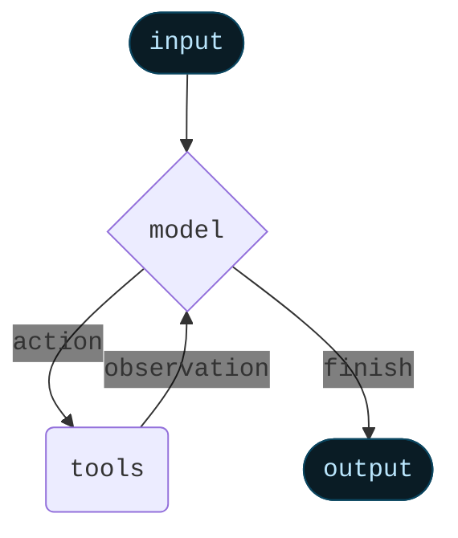

Agents combine language models with [tools](/oss/langchain/tools) to create systems that can reason about tasks, decide which tools to use, and iteratively work towards solutions.

:::python
@[`create_agent`] provides a production-ready agent implementation.
:::
:::js
`createAgent()` provides a production-ready agent implementation.
:::

[An LLM Agent runs tools in a loop to achieve a goal](https://simonwillison.net/2025/Sep/18/agents/).
An agent runs until a stop condition is met - i.e., when the model emits a final output or an iteration limit is reached.



<Info>

:::python
@[`create_agent`] builds a **graph**-based agent runtime using [LangGraph](/oss/langgraph/overview). A graph consists of nodes (steps) and edges (connections) that define how your agent processes information. The agent moves through this graph, executing nodes like the model node (which calls the model), the tools node (which executes tools), or middleware.
:::
:::js
`createAgent()` builds a **graph**-based agent runtime using [LangGraph](/oss/langgraph/overview). A graph consists of nodes (steps) and edges (connections) that define how your agent processes information. The agent moves through this graph, executing nodes like the model node (which calls the model), the tools node (which executes tools), or middleware.
:::

Learn more about the [Graph API](/oss/langgraph/graph-api).

</Info>

## Core components

### Model

The [model](/oss/langchain/models) is the reasoning engine of your agent. It can be specified in multiple ways, supporting both static and dynamic model selection.

#### Static model

Static models are configured once when creating the agent and remain unchanged throughout execution. This is the most common and straightforward approach.

To initialize a static model from a <Tooltip tip="A string that follows the format `provider:model` (e.g. openai:gpt-5)" cta="See mappings" href="https://reference.langchain.com/python/langchain/models/#langchain.chat_models.init_chat_model(model_provider)">model identifier string</Tooltip>:

:::python
```python wrap
from langchain.agents import create_agent

agent = create_agent(
    "gpt-5",
    tools=tools
)
```
:::
:::js
```ts wrap
import { createAgent } from "langchain";

const agent = createAgent({
  model: "openai:gpt-5",
  tools: []
});
```
:::

:::python
<Tip>
    Model identifier strings support automatic inference (e.g., `"gpt-5"` will be inferred as `"openai:gpt-5"`). Refer to the @[reference][init_chat_model(model_provider)] to see a full list of model identifier string mappings.
</Tip>

For more control over the model configuration, initialize a model instance directly using the provider package. In this example, we use @[`ChatOpenAI`]. See [Chat models](/oss/integrations/chat) for other available chat model classes.

```python wrap
from langchain.agents import create_agent
from langchain_openai import ChatOpenAI

model = ChatOpenAI(
    model="gpt-5",
    temperature=0.1,
    max_tokens=1000,
    timeout=30
    # ... (other params)
)
agent = create_agent(model, tools=tools)
```

Model instances give you complete control over configuration. Use them when you need to set specific [parameters](/oss/langchain/models#parameters) like `temperature`, `max_tokens`, `timeouts`, `base_url`, and other provider-specific settings. Refer to the [reference](/oss/integrations/providers/all_providers) to see available params and methods on your model.
:::
:::js
Model identifier strings use the format `provider:model` (e.g. `"openai:gpt-5"`). You may want more control over the model configuration, in which case you can initialize a model instance directly using the provider package:

```ts wrap
import { createAgent } from "langchain";
import { ChatOpenAI } from "@langchain/openai";

const model = new ChatOpenAI({
  model: "gpt-4o",
  temperature: 0.1,
  maxTokens: 1000,
  timeout: 30
});

const agent = createAgent({
  model,
  tools: []
});
```

Model instances give you complete control over configuration. Use them when you need to set specific parameters like `temperature`, `max_tokens`, `timeouts`, or configure API keys, `base_url`, and other provider-specific settings. Refer to the [API reference](/oss/integrations/providers/) to see available params and methods on your model.
:::

#### Dynamic model

Dynamic models are selected at <Tooltip tip="The execution environment of your agent, containing immutable configuration and contextual data that persists throughout the agent's execution (e.g., user IDs, session details, or application-specific configuration).">runtime</Tooltip> based on the current <Tooltip tip="The data that flows through your agent's execution, including messages, custom fields, and any information that needs to be tracked and potentially modified during processing (e.g., user preferences or tool usage stats).">state</Tooltip> and context. This enables sophisticated routing logic and cost optimization.

:::python

To use a dynamic model, create middleware using the @[`@wrap_model_call`] decorator that modifies the model in the request:

```python
from langchain_openai import ChatOpenAI
from langchain.agents import create_agent
from langchain.agents.middleware import wrap_model_call, ModelRequest, ModelResponse


basic_model = ChatOpenAI(model="gpt-4o-mini")
advanced_model = ChatOpenAI(model="gpt-4o")

@wrap_model_call
def dynamic_model_selection(request: ModelRequest, handler) -> ModelResponse:
    """Choose model based on conversation complexity."""
    message_count = len(request.state["messages"])

    if message_count > 10:
        # Use an advanced model for longer conversations
        model = advanced_model
    else:
        model = basic_model

    request.model = model
    return handler(request)

agent = create_agent(
    model=basic_model,  # Default model
    tools=tools,
    middleware=[dynamic_model_selection]
)
```

<Warning>
Pre-bound models (models with @[`bind_tools`][BaseChatModel.bind_tools] already called) are not supported when using structured output. If you need dynamic model selection with structured output, ensure the models passed to the middleware are not pre-bound.
</Warning>

:::
:::js

To use a dynamic model, create middleware with `wrapModelCall` that modifies the model in the request:

```ts
import { ChatOpenAI } from "@langchain/openai";
import { createAgent, createMiddleware } from "langchain";

const basicModel = new ChatOpenAI({ model: "gpt-4o-mini" });
const advancedModel = new ChatOpenAI({ model: "gpt-4o" });

const dynamicModelSelection = createMiddleware({
  name: "DynamicModelSelection",
  wrapModelCall: (request, handler) => {
    // Choose model based on conversation complexity
    const messageCount = request.messages.length;

    return handler({
        ...request,
        model: messageCount > 10 ? advancedModel : basicModel,
    });
  },
});

const agent = createAgent({
  model: "gpt-4o-mini", // Base model (used when messageCount ≤ 10)
  tools,
  middleware: [dynamicModelSelection] as const,
});
```

For more details on middleware and advanced patterns, see the [middleware documentation](/oss/langchain/middleware).
:::

<Tip>
For model configuration details, see [Models](/oss/langchain/models). For dynamic model selection patterns, see [Dynamic model in middleware](/oss/langchain/middleware#dynamic-model).
</Tip>

### Tools

Tools give agents the ability to take actions. Agents go beyond simple model-only tool binding by facilitating:

- Multiple tool calls in sequence (triggered by a single prompt)
- Parallel tool calls when appropriate
- Dynamic tool selection based on previous results
- Tool retry logic and error handling
- State persistence across tool calls

For more information, see [Tools](/oss/langchain/tools).

#### Defining tools

Pass a list of tools to the agent.

:::python
```python wrap
from langchain.tools import tool
from langchain.agents import create_agent


@tool
def search(query: str) -> str:
    """Search for information."""
    return f"Results for: {query}"

@tool
def get_weather(location: str) -> str:
    """Get weather information for a location."""
    return f"Weather in {location}: Sunny, 72°F"

agent = create_agent(model, tools=[search, get_weather])
```
:::
:::js
```ts wrap
import * as z from "zod";
import { createAgent, tool } from "langchain";

const search = tool(
  ({ query }) => `Results for: ${query}`,
  {
    name: "search",
    description: "Search for information",
    schema: z.object({
      query: z.string().describe("The query to search for"),
    }),
  }
);

const getWeather = tool(
  ({ location }) => `Weather in ${location}: Sunny, 72°F`,
  {
    name: "get_weather",
    description: "Get weather information for a location",
    schema: z.object({
      location: z.string().describe("The location to get weather for"),
    }),
  }
);

const agent = createAgent({
  model: "gpt-4o",
  tools: [search, getWeather],
});
```
:::

If an empty tool list is provided, the agent will consist of a single LLM node without tool-calling capabilities.

#### Tool error handling

:::python

To customize how tool errors are handled, use the @[`@wrap_tool_call`] decorator to create middleware:

```python wrap
from langchain.agents import create_agent
from langchain.agents.middleware import wrap_tool_call
from langchain_core.messages import ToolMessage


@wrap_tool_call
def handle_tool_errors(request, handler):
    """Handle tool execution errors with custom messages."""
    try:
        return handler(request)
    except Exception as e:
        # Return a custom error message to the model
        return ToolMessage(
            content=f"Tool error: Please check your input and try again. ({str(e)})",
            tool_call_id=request.tool_call["id"]
        )

agent = create_agent(
    model="gpt-4o",
    tools=[search, get_weather],
    middleware=[handle_tool_errors]
)
```

The agent will return a @[`ToolMessage`] with the custom error message when a tool fails:

```python
[
    ...
    ToolMessage(
        content="Tool error: Please check your input and try again. (division by zero)",
        tool_call_id="..."
    ),
    ...
]
```

:::
:::js

To customize how tool errors are handled, use the `wrapToolCall` hook in a custom middleware:

```ts wrap
import { createAgent, createMiddleware, ToolMessage } from "langchain";

const handleToolErrors = createMiddleware({
  name: "HandleToolErrors",
  wrapToolCall: (request, handler) => {
    try {
      return handler(request);
    } catch (error) {
      // Return a custom error message to the model
      return new ToolMessage({
        content: `Tool error: Please check your input and try again. (${error})`,
        tool_call_id: request.toolCall.id!,
      });
    }
  },
});

const agent = createAgent({
  model: "gpt-4o",
  tools: [
    /* ... */
  ],
  middleware: [handleToolErrors] as const,
});
```

The agent will return a @[`ToolMessage`] with the custom error message when a tool fails.
:::

#### Tool use in the ReAct loop

Agents follow the ReAct ("Reasoning + Acting") pattern, alternating between brief reasoning steps with targeted tool calls and feeding the resulting observations into subsequent decisions until they can deliver a final answer.

<Accordion title="Example of ReAct loop">
Prompt: Identify the current most popular wireless headphones and verify availability.

```
================================ Human Message =================================

Find the most popular wireless headphones right now and check if they're in stock
```

* **Reasoning**: "Popularity is time-sensitive, I need to use the provided search tool."
* **Acting**: Call `search_products("wireless headphones")`

```
================================== Ai Message ==================================
Tool Calls:
  search_products (call_abc123)
 Call ID: call_abc123
  Args:
    query: wireless headphones
```
```
================================= Tool Message =================================

Found 5 products matching "wireless headphones". Top 5 results: WH-1000XM5, ...
```

* **Reasoning**: "I need to confirm availability for the top-ranked item before answering."
* **Acting**: Call `check_inventory("WH-1000XM5")`

```
================================== Ai Message ==================================
Tool Calls:
  check_inventory (call_def456)
 Call ID: call_def456
  Args:
    product_id: WH-1000XM5
```
```
================================= Tool Message =================================

Product WH-1000XM5: 10 units in stock
```

* **Reasoning**: "I have the most popular model and its stock status. I can now answer the user's question."
* **Acting**: Produce final answer

```
================================== Ai Message ==================================

I found wireless headphones (model WH-1000XM5) with 10 units in stock...
```
</Accordion>

<Tip>
To learn more about tools, see [Tools](/oss/langchain/tools).
</Tip>

### System prompt

You can shape how your agent approaches tasks by providing a prompt. The @[`system_prompt`] parameter can be provided as a string:

:::python
```python wrap
agent = create_agent(
    model,
    tools,
    system_prompt="You are a helpful assistant. Be concise and accurate."
)
```
:::
:::js
```ts wrap
const agent = createAgent({
  model,
  tools,
  systemPrompt: "You are a helpful assistant. Be concise and accurate.",
});
```
:::

When no @[`system_prompt`] is provided, the agent will infer its task from the messages directly.

#### Dynamic system prompt

For more advanced use cases where you need to modify the system prompt based on runtime context or agent state, you can use [middleware](/oss/langchain/middleware).

:::python

The @[`@dynamic_prompt`] decorator creates middleware that generates system prompts dynamically based on the model request:

```python wrap
from typing import TypedDict

from langchain.agents import create_agent
from langchain.agents.middleware import dynamic_prompt, ModelRequest


class Context(TypedDict):
    user_role: str

@dynamic_prompt
def user_role_prompt(request: ModelRequest) -> str:
    """Generate system prompt based on user role."""
    user_role = request.runtime.context.get("user_role", "user")
    base_prompt = "You are a helpful assistant."

    if user_role == "expert":
        return f"{base_prompt} Provide detailed technical responses."
    elif user_role == "beginner":
        return f"{base_prompt} Explain concepts simply and avoid jargon."

    return base_prompt

agent = create_agent(
    model="gpt-4o",
    tools=[web_search],
    middleware=[user_role_prompt],
    context_schema=Context
)

# The system prompt will be set dynamically based on context
result = agent.invoke(
    {"messages": [{"role": "user", "content": "Explain machine learning"}]},
    context={"user_role": "expert"}
)
```
:::

:::js
```typescript wrap
import * as z from "zod";
import { createAgent, dynamicSystemPromptMiddleware } from "langchain";

const contextSchema = z.object({
  userRole: z.enum(["expert", "beginner"]),
});

const agent = createAgent({
  model: "gpt-4o",
  tools: [/* ... */],
  contextSchema,
  middleware: [
    dynamicSystemPromptMiddleware<z.infer<typeof contextSchema>>((state, runtime) => {
      const userRole = runtime.context.userRole || "user";
      const basePrompt = "You are a helpful assistant.";

      if (userRole === "expert") {
        return `${basePrompt} Provide detailed technical responses.`;
      } else if (userRole === "beginner") {
        return `${basePrompt} Explain concepts simply and avoid jargon.`;
      }
      return basePrompt;
    }),
  ],
});

// The system prompt will be set dynamically based on context
const result = await agent.invoke(
  { messages: [{ role: "user", content: "Explain machine learning" }] },
  { context: { userRole: "expert" } }
);
```
:::

<Tip>
For more details on message types and formatting, see [Messages](/oss/langchain/messages). For comprehensive middleware documentation, see [Middleware](/oss/langchain/middleware).
</Tip>

## Invocation

You can invoke an agent by passing an update to its [`State`](/oss/langgraph/graph-api#state). All agents include a [sequence of messages](/oss/langgraph/use-graph-api#messagesstate) in their state; to invoke the agent, pass a new message:

:::python
```python
result = agent.invoke(
    {"messages": [{"role": "user", "content": "What's the weather in San Francisco?"}]}
)
```
:::
:::js
```typescript
await agent.invoke({
  messages: [{ role: "user", content: "What's the weather in San Francisco?" }],
})
```
:::

For streaming steps and / or tokens from the agent, refer to the [streaming](/oss/langchain/streaming) guide.

Otherwise, the agent follows the LangGraph [Graph API](/oss/langgraph/use-graph-api) and supports all associated methods.

## Advanced concepts

### Structured output

:::python

In some situations, you may want the agent to return an output in a specific format. LangChain provides strategies for structured output via the @[`response_format`][ModelRequest(response_format)] parameter.

#### ToolStrategy

`ToolStrategy` uses artificial tool calling to generate structured output. This works with any model that supports tool calling:

```python wrap
from pydantic import BaseModel
from langchain.agents import create_agent
from langchain.agents.structured_output import ToolStrategy


class ContactInfo(BaseModel):
    name: str
    email: str
    phone: str

agent = create_agent(
    model="gpt-4o-mini",
    tools=[search_tool],
    response_format=ToolStrategy(ContactInfo)
)

result = agent.invoke({
    "messages": [{"role": "user", "content": "Extract contact info from: John Doe, john@example.com, (555) 123-4567"}]
})

result["structured_response"]
# ContactInfo(name='John Doe', email='john@example.com', phone='(555) 123-4567')
```

#### ProviderStrategy

`ProviderStrategy` uses the model provider's native structured output generation. This is more reliable but only works with providers that support native structured output (e.g., OpenAI):

```python wrap
from langchain.agents.structured_output import ProviderStrategy

agent = create_agent(
    model="gpt-4o",
    response_format=ProviderStrategy(ContactInfo)
)
```

<Note>
As of `langchain 1.0`, simply passing a schema (e.g., `response_format=ContactInfo`) is no longer supported. You must explicitly use `ToolStrategy` or `ProviderStrategy`.
</Note>

:::
:::js
In some situations, you may want the agent to return an output in a specific format. LangChain provides a simple, universal way to do this with the `responseFormat` parameter.

```ts wrap
import * as z from "zod";
import { createAgent } from "langchain";

const ContactInfo = z.object({
  name: z.string(),
  email: z.string(),
  phone: z.string(),
});

const agent = createAgent({
  model: "gpt-4o",
  responseFormat: ContactInfo,
});

const result = await agent.invoke({
  messages: [
    {
      role: "user",
      content: "Extract contact info from: John Doe, john@example.com, (555) 123-4567",
    },
  ],
});

console.log(result.structuredResponse);
// {
//   name: 'John Doe',
//   email: 'john@example.com',
//   phone: '(555) 123-4567'
// }
```
:::
<Tip>
To learn about structured output, see [Structured output](/oss/langchain/structured-output).
</Tip>

### Memory

Agents maintain conversation history automatically through the message state. You can also configure the agent to use a custom state schema to remember additional information during the conversation.

Information stored in the state can be thought of as the [short-term memory](/oss/langchain/short-term-memory) of the agent:

:::python

Custom state schemas must extend @[`AgentState`] as a `TypedDict`.

There are two ways to define custom state:
1. Via [middleware](/oss/langchain/middleware) (preferred)
2. Via @[`state_schema`] on @[`create_agent`]

<Note>
Defining custom state via middleware is preferred over defining it via @[`state_schema`] on @[`create_agent`] because it allows you to keep state extensions conceptually scoped to the relevant middleware and tools.

@[`state_schema`] is still supported for backwards compatibility on @[`create_agent`].
</Note>

#### Defining state via middleware

Use middleware to define custom state when your custom state needs to be accessed by specific middleware hooks and tools attached to said middleware.

```python
from langchain.agents import AgentState
from langchain.agents.middleware import AgentMiddleware


class CustomState(AgentState):
    user_preferences: dict

class CustomMiddleware(AgentMiddleware):
    state_schema = CustomState
    tools = [tool1, tool2]

    def before_model(self, state: CustomState, runtime) -> dict[str, Any] | None:
        ...

agent = create_agent(
    model,
    tools=tools,
    middleware=[CustomMiddleware()]
)

# The agent can now track additional state beyond messages
result = agent.invoke({
    "messages": [{"role": "user", "content": "I prefer technical explanations"}],
    "user_preferences": {"style": "technical", "verbosity": "detailed"},
})
```

#### Defining state via `state_schema`

Use the @[`state_schema`] parameter as a shortcut to define custom state that is only used in tools.

```python
from langchain.agents import AgentState


class CustomState(AgentState):
    user_preferences: dict

agent = create_agent(
    model,
    tools=[tool1, tool2],
    state_schema=CustomState
)
# The agent can now track additional state beyond messages
result = agent.invoke({
    "messages": [{"role": "user", "content": "I prefer technical explanations"}],
    "user_preferences": {"style": "technical", "verbosity": "detailed"},
})
```

<Note>
As of `langchain 1.0`, custom state schemas **must** be `TypedDict` types. Pydantic models and dataclasses are no longer supported. See the [v1 migration guide](/oss/migrate/langchain-v1#state-type-restrictions) for more details.
</Note>

:::
:::js
```ts wrap
import * as z from "zod";
import { MessagesZodState } from "@langchain/langgraph";
import { createAgent, type BaseMessage } from "langchain";

const customAgentState = z.object({
  messages: MessagesZodState.shape.messages,
  userPreferences: z.record(z.string(), z.string()),
});

const CustomAgentState = createAgent({
  model: "gpt-4o",
  tools: [],
  stateSchema: customAgentState,
});
```
:::

<Tip>
To learn more about memory, see [Memory](/oss/concepts/memory). For information on implementing long-term memory that persists across sessions, see [Long-term memory](/oss/langchain/long-term-memory).
</Tip>

### Streaming

We've seen how the agent can be called with `invoke` to get a final response. If the agent executes multiple steps, this may take a while. To show intermediate progress, we can stream back messages as they occur.

:::python
```python
for chunk in agent.stream({
    "messages": [{"role": "user", "content": "Search for AI news and summarize the findings"}]
}, stream_mode="values"):
    # Each chunk contains the full state at that point
    latest_message = chunk["messages"][-1]
    if latest_message.content:
        print(f"Agent: {latest_message.content}")
    elif latest_message.tool_calls:
        print(f"Calling tools: {[tc['name'] for tc in latest_message.tool_calls]}")
```
:::
:::js
```ts
const stream = await agent.stream(
  {
    messages: [{
      role: "user",
      content: "Search for AI news and summarize the findings"
    }],
  },
  { streamMode: "values" }
);

for await (const chunk of stream) {
  // Each chunk contains the full state at that point
  const latestMessage = chunk.messages.at(-1);
  if (latestMessage?.content) {
    console.log(`Agent: ${latestMessage.content}`);
  } else if (latestMessage?.tool_calls) {
    const toolCallNames = latestMessage.tool_calls.map((tc) => tc.name);
    console.log(`Calling tools: ${toolCallNames.join(", ")}`);
  }
}
```
:::

<Tip>
For more details on streaming, see [Streaming](/oss/langchain/streaming).
</Tip>

### Middleware

[Middleware](/oss/langchain/middleware) provides powerful extensibility for customizing agent behavior at different stages of execution. You can use middleware to:

- Process state before the model is called (e.g., message trimming, context injection)
- Modify or validate the model's response (e.g., guardrails, content filtering)
- Handle tool execution errors with custom logic
- Implement dynamic model selection based on state or context
- Add custom logging, monitoring, or analytics

Middleware integrates seamlessly into the agent's execution graph, allowing you to intercept and modify data flow at key points without changing the core agent logic.

:::python
<Tip>
For comprehensive middleware documentation including decorators like @[`@before_model`], @[`@after_model`], and @[`@wrap_tool_call`], see [Middleware](/oss/langchain/middleware).
</Tip>
:::

:::js
<Tip>
For comprehensive middleware documentation including hooks like `beforeModel`, `afterModel`, and `wrapToolCall`, see [Middleware](/oss/langchain/middleware).
</Tip>
:::
